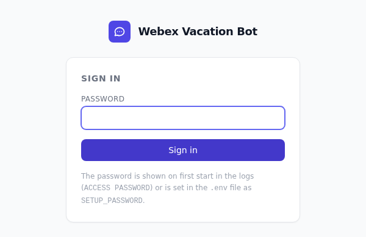
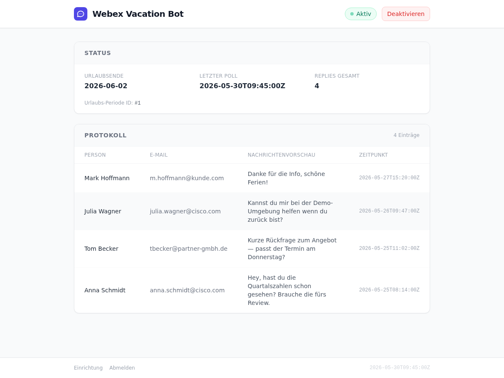
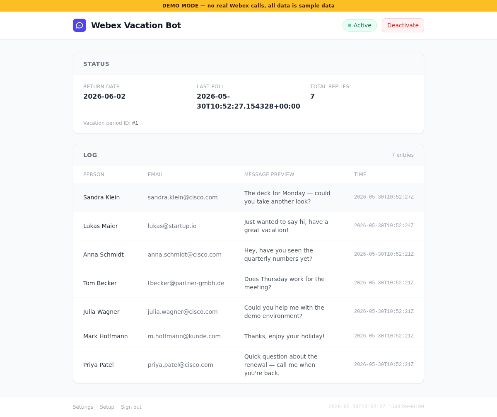

# Webex Vacation Auto-Reply Bot

Automatic out-of-office auto-replies for Webex — similar to an email out-of-office notice, but for Webex direct messages.

**What it does:**
- Polls your Webex DMs every 15 minutes
- Replies to each person exactly once per vacation period
- Automatically distinguishes between internal and external contacts (configurable internal domain)
- Complete log per vacation period, clustered into a browsable history — persisted across restarts
- Automatically disables itself on the return date
- Bot can be activated/deactivated with a single click — no terminal required

**What it does NOT do:**
- Reply in group rooms or spaces (1:1 DMs only)
- Forward or store messages

**Requirements:**
- Docker Desktop (Windows/Mac) or Docker on Linux/NAS
- Webex account + one-time app registration (~5 minutes)
- No programming knowledge required

|  |  |
|---|---|
|  |  |
| *Password-protected sign in* | *Status page with log* |

---

## ⚡ Try it instantly (Demo mode)

Click through the entire bot — **without a Webex account, without registration, without credentials**:

```bash
git clone https://github.com/desmomolle/webex-vacation-bot.git
cd webex-vacation-bot
docker compose run --rm -e DEMO_MODE=true -p 8080:8080 webex-vacation-bot
```

Then open **[http://localhost:8080](http://localhost:8080)**, password: **`demo`**.

In demo mode, **no** real Webex/mail/LLM calls are made. Instead:
- Sample log data is pre-populated,
- the "Authorize with Webex" step in the wizard is simulated (you can click through it completely),
- every few seconds a new demo message "arrives", so the log fills up live.



---

## Quick start

> **Tip for Synology/QNAP:** Step 3 is not needed — everything runs in the browser. No terminal required.

### 1. Register a Webex app

Open [developer.webex.com](https://developer.webex.com) → **My Webex Apps** → **Create a New App** → **Integration**

Important fields:
- **Redirect URI:** `http://localhost:8080/setup/webex/callback`
  *(On NAS: `http://nas-ip:8080/setup/webex/callback`)*
- **Scopes:** `spark:messages_write`, `spark:rooms_read`, `spark:memberships_read`

Copy **Client ID** and **Client Secret**.

### 2. Download & configure the project

```bash
git clone https://github.com/desmomolle/webex-vacation-bot.git
cd webex-vacation-bot
cp .env.example .env
```

Open `.env` and fill in:
```
MY_WEBEX_EMAIL=dein.name@cisco.com
WEBEX_CLIENT_ID=...
WEBEX_CLIENT_SECRET=...
```

### 3. Start the bot

```bash
docker compose up -d
```

### 4. Complete setup in the browser

Open **[http://localhost:8080/setup](http://localhost:8080/setup)**
*(On NAS: `http://nas-ip:8080/setup`)*

The access password is shown in the logs:
```bash
docker logs webex-vacation-bot 2>&1 | grep "ACCESS PASSWORD"
```

Use this password to sign in — it protects both the Status page
and the setup wizard. Set `SETUP_PASSWORD=...` in `.env`
if you prefer a fixed password.

The wizard guides you through:
1. Authorize Webex (browser sign-in, one-time)
2. Reply settings (internal domain, reply templates)
3. Optional settings (email report, AI summary)
4. Summary

**The setup is one-time.** The bot can then run permanently (e.g. on a NAS).
Whenever you go on vacation, you set your **return date** and **activate** the
auto-reply right on the dashboard — no need to re-run the wizard.

**Done.** Status and controls at [http://localhost:8080](http://localhost:8080).

---

## Controlling the bot

**Via browser:**
On the dashboard at `http://localhost:8080`, pick your **return date** ("Vacation until")
and click **"Activate"**. Click **"Deactivate"** to stop early. No terminal required.

The bot also **automatically disables itself** once the return date has passed — the
next poll closes the vacation period and stops replying.

**Stop the container** (shut down completely):
```bash
docker compose down
```

---

## Deployment options

### Windows / Mac (Docker Desktop)

Exactly as in Quick start. Docker Desktop must be running at startup (`restart: unless-stopped` ensures autostart).

### Linux

```bash
curl -fsSL https://get.docker.com | sh   # Install Docker
docker compose up -d
```
Browser → `http://localhost:8080/setup`

### Synology NAS (DSM 7.2+)

1. **Container Manager** → **Project** → **Create**
2. Upload the project files to a NAS folder (e.g. `/docker/webex-vacation-bot`)
3. Select `docker-compose.yml`
4. Set environment variables: `MY_WEBEX_EMAIL`, `WEBEX_CLIENT_ID`, `WEBEX_CLIENT_SECRET`
5. Start container → Browser: `http://nas-ip:8080/setup`

Everything else is handled by the wizard — no terminal, no Python.

### QNAP NAS

1. **Container Station** → **Applications** → **Create**
2. Upload `docker-compose.yml`
3. Set environment variables: `MY_WEBEX_EMAIL`, `WEBEX_CLIENT_ID`, `WEBEX_CLIENT_SECRET`
4. Start container → Browser: `http://nas-ip:8080/setup`

> NAS advantage: The bot runs 24/7 without a PC. The SQLite file lives in the NAS volume and is backed up automatically.

### Raspberry Pi

```bash
curl -fsSL https://get.docker.com | sh
docker compose up -d
```
Browser → `http://raspberry-pi-ip:8080/setup`

---

## Optional — Email report at vacation end

Configurable in the setup wizard (step 3) or manually in `.env`:

### Option A — Gmail OAuth (recommended, no app password)

1. [Google Cloud Console](https://console.cloud.google.com) → Enable Gmail API → Create OAuth 2.0 Client ID (type: Desktop)
2. In the wizard: click the Gmail button → browser sign-in → done

Or manually:
```
GMAIL_CLIENT_ID=...
GMAIL_CLIENT_SECRET=...
MAIL_TO=dein.name@cisco.com
```
Then run once in the project folder: `python get_gmail_token.py`

### Option B — SMTP

Configurable in the wizard or in `.env`:
```
MAIL_TO=dein.name@cisco.com
SMTP_HOST=smtp.office365.com
SMTP_PORT=587
SMTP_USER=dein.name@firma.com
SMTP_PASSWORD=...
```
Works with Outlook, Cisco Mail, Gmail (app password).

---

## Optional — AI summary

Automatically classifies messages at vacation end as "urgent / can wait".

In the wizard (step 3) or in `.env` — one key is enough, Gemini takes priority:
```
GEMINI_API_KEY=...    # Google Gemini Flash (recommended)
OPENAI_API_KEY=...    # OpenAI GPT-4o-mini
```
Cost: a single call at vacation end, < 1000 tokens → cents.

---

## Logs & diagnostics

**Live logs:**
```bash
docker logs webex-vacation-bot -f
```

**Read access password from logs:**
```bash
docker logs webex-vacation-bot 2>&1 | grep "ACCESS PASSWORD"
```

**On Synology:** Container Manager → select container → **"Log"** tab

**On QNAP:** Container Station → Container → **"Log"**

**Typical log messages:**
- `Poll result:` — result of the 15-minute check
- `Replied to:` — who received a reply
- `vacation ended — auto-disabled` — bot automatically deactivated itself
- `Token refresh` — Webex token was renewed (normal, no action needed)
- `ACCESS PASSWORD` — shown once at first startup (sign-in password)

---

## Security

- **Login on everything** — Status page, log, API, and wizard are all behind a password sign-in (signed session cookies). Without signing in, nobody can see who wrote to you. Only `/health` is public. The password is generated automatically at first startup and shown in the logs; fixed password: `SETUP_PASSWORD=...` in `.env`.
- **Tokens encrypted** — `data/tokens.json` is Fernet-encrypted from the start (including right after setup). Key stored in `data/.key`, generated automatically at first startup.
- **Back up the `data/` folder** — contains the encryption key, session key, and database. Without the key, stored tokens cannot be recovered.
- **OAuth secured** — the `state` parameter is validated against a one-time cookie (protection against OAuth CSRF / code injection).
- **Secrets masked** — Client Secret, API keys, and SMTP password are shown in the summary as `abcd****` only.
- **CSRF protection** — all forms and the toggle API are secured with a double-submit token; session cookies use `SameSite=Lax`, `secure` automatically with HTTPS.

> Port 8080 should **not** be directly accessible from the internet. For external access: use a VPN or a Cloudflare Tunnel with an Access policy.

---

## FAQ

**The wizard opens, but Webex authorization fails**
→ Check the Redirect URI in developer.webex.com: it must be exactly `http://localhost:8080/setup/webex/callback` (or NAS IP instead of localhost).

**"Token refresh failed"**
→ Client ID or Client Secret is wrong. Copy the values from developer.webex.com again and re-enter them in the wizard.

**Status page always shows "Inactive"**
→ On the dashboard, pick a return date and click **Activate**. The bot stays inactive until you do.

**The bot does not reply to test messages**
→ Messages must be 1:1 DMs (no group rooms). Check the logs: `docker logs webex-vacation-bot`.

**Messages from the past are being replied to**
→ Normal behavior on first startup. The bot processes all DMs from the start of the vacation period. Replies are never sent twice.

**How do I see who wrote to me?**
→ The Status page at `http://localhost:8080` shows the complete log. Optionally, configure an email report at vacation end.
